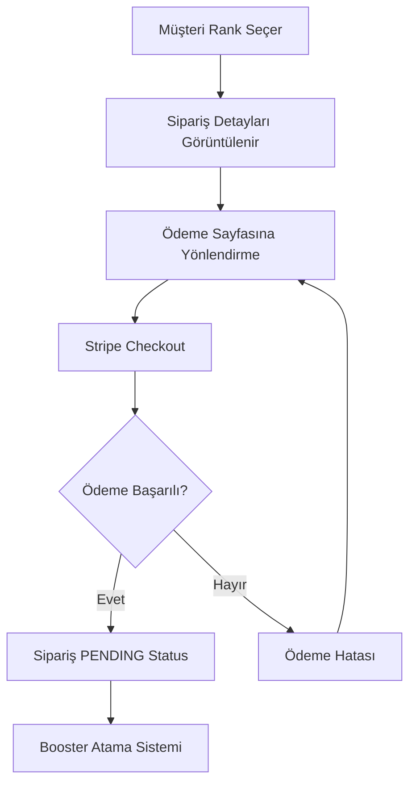

# 🎮 Boost Sipariş Sistemi - Sistem Mimarisi

## 📋 Genel Bakış

Bu dokümantasyon, AtlastBoost platformunda boost siparişlerinin nasıl oluşturulduğu, booster'lara nasıl atandığı ve tüm sürecin nasıl yönetildiği hakkında detaylı bilgi içerir.

---

## 🏗️ Sistem Bileşenleri

### 1️⃣ Veritabanı Modelleri

#### User Model
```prisma
model User {
  id        String   @id @default(cuid())
  email     String   @unique
  name      String?
  password  String?
  role      String   @default("USER") // USER, BOOSTER, ADMIN
  createdAt DateTime @default(now())
  updatedAt DateTime @updatedAt
  
  // Relations
  orders    Order[]  // Müşteri olarak verdiği siparişler
  boostJobs Order[]  @relation("BoosterOrders") // Booster olarak aldığı işler
}
```

#### Order Model
```prisma
model Order {
  id              String      @id @default(cuid())
  userId          String      // Sipariş veren müşteri
  game            String      // lol, valorant
  currentRank     String      // Mevcut rank
  targetRank      String      // Hedef rank
  currentDivision String?     // Mevcut division
  targetDivision  String?     // Hedef division
  price           Decimal     // Sipariş fiyatı
  status          OrderStatus @default(PENDING) // PENDING, ASSIGNED, IN_PROGRESS, COMPLETED, CANCELLED
  boosterId       String?     // Atanan booster
  assignedAt      DateTime?   // Booster atama tarihi
  startedAt       DateTime?   // Boost başlama tarihi
  completedAt     DateTime?   // Boost tamamlanma tarihi
  createdAt       DateTime    @default(now())
  updatedAt       DateTime    @updatedAt
  
  // Relations
  user    User    @relation(fields: [userId], references: [id])
  booster User?   @relation("BoosterOrders", fields: [boosterId], references: [id])
  payments Payment[]
}
```

#### Payment Model
```prisma
model Payment {
  id          String        @id @default(cuid())
  orderId     String
  amount      Decimal
  currency    String        @default("TRY")
  status      PaymentStatus @default(PENDING) // PENDING, COMPLETED, FAILED, REFUNDED
  stripeId    String?       // Stripe payment intent ID
  createdAt   DateTime      @default(now())
  updatedAt   DateTime      @updatedAt
  
  // Relations
  order Order @relation(fields: [orderId], references: [id])
}

enum OrderStatus {
  PENDING      // Sipariş verildi, ödeme bekleniyor
  PAID         // Ödeme tamamlandı, booster atanıyor
  ASSIGNED     // Booster atandı
  IN_PROGRESS  // Boost devam ediyor
  COMPLETED    // Boost tamamlandı
  CANCELLED    // Sipariş iptal edildi
}

enum PaymentStatus {
  PENDING   // Ödeme bekleniyor
  COMPLETED // Ödeme tamamlandı
  FAILED    // Ödeme başarısız
  REFUNDED  // Ödeme iade edildi
}
```

---

## 🔄 Boost Sipariş Akışı

### 1️⃣ Sipariş Oluşturma Süreci



### 2️⃣ Booster Atama Algoritması

#### A) Booster Seçim Kriterleri
1. **Uygunluk Kontrolü**
   - Booster'ın o oyunda aktif olması
   - Müsait durumda olması (max 3 aktif sipariş)
   - Rank aralığında çalışabiliyor olması

2. **Performans Kriterleri**
   - Tamamlanan sipariş sayısı
   - Ortalama tamamlanma süresi
   - Müşteri değerlendirme puanı
   - Son 30 gündeki performans

3. **Adil Dağıtım**
   - Son atama tarihi (en uzun süre bekleyen)
   - Booster'ın mevcut iş yükü

#### B) Atama Algoritması
```typescript
interface BoosterCandidate {
  id: string;
  game: string;
  availableSlots: number;
  performance: {
    completedOrders: number;
    averageCompletionTime: number;
    rating: number;
    lastAssignedAt: Date;
  };
}

function selectBooster(order: Order, candidates: BoosterCandidate[]): BoosterCandidate | null {
  // 1. Uygun booster'ları filtrele
  const suitableBoosters = candidates.filter(booster => 
    booster.game === order.game &&
    booster.availableSlots > 0 &&
    canHandleRankRange(booster, order.currentRank, order.targetRank)
  );

  if (suitableBoosters.length === 0) return null;

  // 2. Performans skorunu hesapla
  const scoredBoosters = suitableBoosters.map(booster => ({
    ...booster,
    score: calculatePerformanceScore(booster)
  }));

  // 3. En yüksek skorlu booster'ı seç
  return scoredBoosters.sort((a, b) => b.score - a.score)[0];
}

function calculatePerformanceScore(booster: BoosterCandidate): number {
  const { completedOrders, averageCompletionTime, rating, lastAssignedAt } = booster.performance;
  
  // Performans skoru hesaplama (0-100 arası)
  const completionScore = Math.min(completedOrders * 2, 50); // Max 50 puan
  const timeScore = Math.max(0, 30 - averageCompletionTime); // Max 30 puan
  const ratingScore = rating * 10; // Max 20 puan
  const waitingBonus = calculateWaitingBonus(lastAssignedAt); // Max 10 puan
  
  return completionScore + timeScore + ratingScore + waitingBonus;
}
```

### 3️⃣ Sipariş Durumu Yönetimi

#### Durum Geçişleri
```
PENDING → PAID → ASSIGNED → IN_PROGRESS → COMPLETED
    ↓         ↓         ↓            ↓
CANCELLED  CANCELLED  CANCELLED  CANCELLED
```

#### Her Durumda Yapılacaklar

**PENDING (Sipariş Beklemede)**
- Ödeme webhook'u bekleniyor
- Müşteriye sipariş onay e-postası gönderildi

**PAID (Ödeme Tamamlandı)**
- Booster atama sistemi devreye girer
- Otomatik atama veya manuel atama bekleniyor

**ASSIGNED (Booster Atandı)**
- Booster'a bildirim gönderildi
- Müşteriye booster bilgileri paylaşıldı
- Boost başlama süresi belirlendi

**IN_PROGRESS (Boost Devam Ediyor)**
- Günlük progress raporları
- Müşteri ve booster arasında iletişim kanalı
- Beklenen tamamlanma tarihi takibi

**COMPLETED (Boost Tamamlandı)**
- Müşteri değerlendirme formu
- Booster'a ödeme yapıldı
- Sipariş arşivlendi

---

## 🎯 API Endpoints

### Sipariş Yönetimi
```typescript
// Yeni sipariş oluştur
POST /api/orders
{
  game: "lol",
  currentRank: "Silver",
  targetRank: "Gold",
  currentDivision: "II",
  targetDivision: "III"
}

// Sipariş detaylarını getir
GET /api/orders/[id]

// Sipariş durumunu güncelle
PUT /api/orders/[id]/status
{
  status: "IN_PROGRESS",
  startedAt: "2024-01-15T10:00:00Z"
}

// Booster atama
POST /api/orders/[id]/assign
{
  boosterId: "booster_user_id"
}
```

### Booster Yönetimi
```typescript
// Müsait booster'ları listele
GET /api/boosters/available?game=lol&rankRange=silver-gold

// Booster performansını getir
GET /api/boosters/[id]/performance

// Booster'a sipariş ata
POST /api/boosters/[id]/assign-order
{
  orderId: "order_id"
}
```

### Dashboard API'leri
```typescript
// Müşteri siparişlerini getir
GET /api/dashboard/orders

// Booster işlerini getir
GET /api/dashboard/boost-jobs

// Admin sipariş yönetimi
GET /api/admin/orders?status=PENDING&page=1&limit=20
```

---

## 📊 Dashboard Görünümleri

### 1️⃣ Müşteri Dashboard'u
- **Aktif Siparişler**: Devam eden boost'lar
- **Sipariş Geçmişi**: Tamamlanan boost'lar
- **Booster İletişim**: Atanan booster ile mesajlaşma
- **Progress Takibi**: Boost ilerlemesi

### 2️⃣ Booster Dashboard'u
- **Atanan İşler**: Aktif boost görevleri
- **İş Geçmişi**: Tamamlanan boost'lar
- **Performans İstatistikleri**: Kazanç, rating, tamamlanan işler
- **Müsaitlik Durumu**: Online/Offline, max iş sayısı

### 3️⃣ Admin Dashboard'u
- **Sipariş Yönetimi**: Tüm siparişlerin listesi
- **Booster Yönetimi**: Booster onayları, performans takibi
- **Finansal Raporlar**: Günlük/aylık gelir raporları
- **Sistem İstatistikleri**: Platform metrikleri

---

## 🔔 Bildirim Sistemi

### E-posta Bildirimleri
```typescript
// Sipariş onayı
sendOrderConfirmation(userEmail, orderDetails)

// Booster atama bildirimi
sendBoosterAssignment(boosterEmail, orderDetails)

// Boost tamamlanma bildirimi
sendCompletionNotification(userEmail, orderDetails)

// Günlük progress raporu
sendProgressReport(userEmail, orderDetails)
```

### Push Bildirimleri
```typescript
// Yeni sipariş bildirimi (Booster'a)
sendPushNotification(boosterId, "Yeni boost işi atandı!")

// Boost başlama bildirimi (Müşteriye)
sendPushNotification(userId, "Boost işiniz başladı!")
```

---

## 💰 Ödeme ve Finansal Sistem

### Stripe Entegrasyonu
```typescript
// Ödeme intent oluştur
POST /api/payments/create-intent
{
  orderId: "order_id",
  amount: 150.00,
  currency: "TRY"
}

// Webhook handler
POST /api/webhooks/stripe
// Stripe'dan gelen ödeme durumu güncellemeleri
```

### Booster Ödemeleri
```typescript
// Booster kazanç hesaplama
function calculateBoosterEarnings(order: Order): number {
  const baseRate = 0.70; // %70 booster'a
  const platformRate = 0.30; // %30 platform'a
  
  return order.price * baseRate;
}

// Haftalık ödeme batch'i
async function processWeeklyPayments() {
  const completedOrders = await getCompletedOrdersThisWeek();
  
  for (const booster of boosters) {
    const earnings = calculateWeeklyEarnings(booster);
    await initiatePayment(booster.stripeAccountId, earnings);
  }
}
```

---

## 📈 Analytics ve Raporlama

### KPI'lar
- **Günlük/Aylık Gelir**
- **Ortalama Sipariş Değeri**
- **Booster Performans Metrikleri**
- **Müşteri Memnuniyet Oranı**
- **Sipariş Tamamlanma Süreleri**

### Raporlar
```typescript
// Günlük satış raporu
GET /api/reports/daily-sales?date=2024-01-15

// Booster performans raporu
GET /api/reports/booster-performance?boosterId=xxx&period=30d

// Müşteri analizi
GET /api/reports/customer-analysis?period=90d
```

---

## 🔒 Güvenlik ve Validasyon

### Sipariş Validasyonu
```typescript
function validateOrder(orderData: OrderData): ValidationResult {
  const errors: string[] = [];
  
  // Rank validasyonu
  if (!isValidRankRange(orderData.currentRank, orderData.targetRank)) {
    errors.push("Geçersiz rank aralığı");
  }
  
  // Fiyat validasyonu
  if (orderData.price <= 0) {
    errors.push("Geçersiz fiyat");
  }
  
  // Oyun validasyonu
  if (!isValidGame(orderData.game)) {
    errors.push("Desteklenmeyen oyun");
  }
  
  return { isValid: errors.length === 0, errors };
}
```

### Rate Limiting
```typescript
// Sipariş oluşturma rate limit
rateLimit({
  windowMs: 15 * 60 * 1000, // 15 dakika
  max: 5, // Maksimum 5 sipariş
  message: "Çok fazla sipariş oluşturuldu. Lütfen bekleyin."
})
```

---

## 🚀 Gelecek Geliştirmeler

### Kısa Vadeli (1-3 ay)
- [ ] Real-time chat sistemi
- [ ] Mobil uygulama
- [ ] Otomatik booster atama
- [ ] Gelişmiş progress tracking

### Orta Vadeli (3-6 ay)
- [ ] AI destekli booster eşleştirme
- [ ] Çoklu oyun desteği
- [ ] Referral sistemi
- [ ] Loyalty programı

### Uzun Vadeli (6+ ay)
- [ ] Machine learning ile fiyat optimizasyonu
- [ ] Blockchain tabanlı güven sistemi
- [ ] Uluslararası genişleme
- [ ] Franchise sistemi

---

## 📞 Destek ve İletişim

### Teknik Destek
- **E-posta**: tech@atlastboost.com
- **Discord**: AtlastBoost Support
- **Telefon**: +90 XXX XXX XX XX

### Acil Durumlar
- **7/24 Destek Hattı**: +90 XXX XXX XX XX
- **Emergency Email**: emergency@atlastboost.com

---

*Bu dokümantasyon, AtlastBoost platformunun boost sipariş sistemi hakkında kapsamlı bir rehberdir. Sistem geliştikçe bu dokümantasyon da güncellenecektir.*

**Son Güncelleme**: 9 Ekim 2024
**Versiyon**: 1.0.0
