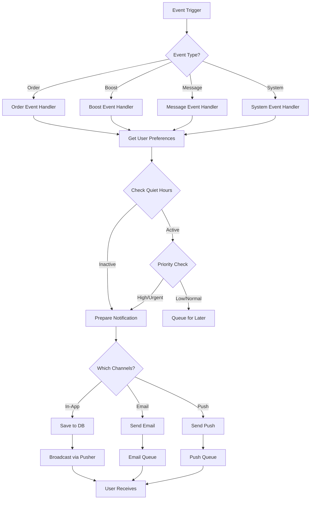

# 🔔 Bildirim Sistemi - Sistem Mimarisi

## 📋 Genel Bakış

Bu dokümantasyon, AtlastBoost platformunda kullanılan bildirim sisteminin tüm detaylarını içerir. Sistem, kullanıcılara sipariş güncellemeleri, booster atamaları ve diğer önemli olaylar hakkında anlık bilgilendirme sağlar.

### Desteklenen Bildirim Kanalları
- **In-App Notifications**: Uygulama içi bildirim merkezi
- **Email Notifications**: E-posta bildirimleri
- **Push Notifications**: Web ve mobil push bildirimleri

---

## 🏗️ Veritabanı Modelleri

### Notification Model
```prisma
model Notification {
  id          String           @id @default(cuid())
  userId      String           // Bildirimin gönderildiği kullanıcı
  type        NotificationType // Bildirim türü
  title       String           // Bildirim başlığı
  message     String           // Bildirim mesajı
  data        Json?            // Ek bildirim verisi (orderId, boosterId, vb.)
  read        Boolean          @default(false) // Okundu mu?
  readAt      DateTime?        // Okunma zamanı
  channels    Json             // Gönderildiği kanallar ["in_app", "email", "push"]
  priority    NotificationPriority @default(NORMAL) // LOW, NORMAL, HIGH, URGENT
  actionUrl   String?          // Bildirime tıklandığında yönlendirilecek URL
  createdAt   DateTime         @default(now())
  expiresAt   DateTime?        // Bildirimin son geçerlilik tarihi
  
  // Relations
  user User @relation(fields: [userId], references: [id], onDelete: Cascade)
  
  @@index([userId, read])
  @@index([userId, createdAt])
  @@index([type])
}

enum NotificationType {
  // Sipariş Bildirimleri
  ORDER_CREATED           // Sipariş oluşturuldu
  ORDER_PAYMENT_CONFIRMED // Ödeme onaylandı
  ORDER_BOOSTER_ASSIGNED  // Booster atandı
  ORDER_STARTED           // Boost başladı
  ORDER_PROGRESS_UPDATE   // İlerleme güncellendi
  ORDER_COMPLETED         // Boost tamamlandı
  ORDER_CANCELLED         // Sipariş iptal edildi
  
  // Booster Bildirimleri
  BOOST_JOB_ASSIGNED      // Yeni iş atandı
  BOOST_JOB_REMINDER      // İş hatırlatması
  BOOST_JOB_DEADLINE      // Son tarih yaklaşıyor
  BOOST_PAYMENT_PROCESSED // Ödeme yapıldı
  
  // Mesaj Bildirimleri
  MESSAGE_RECEIVED        // Yeni mesaj alındı
  CHAT_SUPPORT_REPLY      // Destek yanıtı
  
  // Sistem Bildirimleri
  SYSTEM_MAINTENANCE      // Sistem bakımı
  SYSTEM_UPDATE           // Sistem güncellemesi
  ACCOUNT_UPDATE          // Hesap güncellemesi
  SECURITY_ALERT          // Güvenlik uyarısı
}

enum NotificationPriority {
  LOW      // Düşük öncelik
  NORMAL   // Normal öncelik
  HIGH     // Yüksek öncelik
  URGENT   // Acil
}
```

### NotificationPreference Model
```prisma
model NotificationPreference {
  id        String   @id @default(cuid())
  userId    String   @unique
  
  // Kanal Tercihleri
  emailEnabled      Boolean @default(true)
  pushEnabled       Boolean @default(true)
  inAppEnabled      Boolean @default(true)
  
  // Bildirim Türü Tercihleri
  orderUpdates      Boolean @default(true)
  boostUpdates      Boolean @default(true)
  messages          Boolean @default(true)
  marketing         Boolean @default(false)
  systemUpdates     Boolean @default(true)
  
  // Sessiz Saatler
  quietHoursEnabled Boolean @default(false)
  quietHoursStart   String? // "22:00"
  quietHoursEnd     String? // "08:00"
  
  // Push Token'ları
  pushTokens        Json    @default("[]") // Web ve mobil push token'ları
  
  createdAt DateTime @default(now())
  updatedAt DateTime @updatedAt
  
  // Relations
  user User @relation(fields: [userId], references: [id], onDelete: Cascade)
}
```

### User Model Güncellemesi
```prisma
model User {
  // ... mevcut alanlar
  notifications           Notification[]
  notificationPreference  NotificationPreference?
}
```

---

## 🔄 Bildirim Akış Şeması



---

## 🎯 Bildirim Senaryoları

### 1️⃣ Sipariş Oluşturma
**Trigger**: Yeni sipariş oluşturulduğunda

```typescript
// Müşteriye
{
  type: "ORDER_CREATED",
  title: "Siparişiniz Oluşturuldu",
  message: "League of Legends Silver II → Gold III boost siparişiniz başarıyla oluşturuldu.",
  priority: "NORMAL",
  channels: ["in_app", "email"],
  actionUrl: "/dashboard/orders/{orderId}",
  data: {
    orderId: "xxx",
    game: "lol",
    currentRank: "Silver II",
    targetRank: "Gold III",
    price: 250
  }
}
```

### 2️⃣ Ödeme Onayı
**Trigger**: Stripe webhook'tan ödeme onayı geldiğinde

```typescript
// Müşteriye
{
  type: "ORDER_PAYMENT_CONFIRMED",
  title: "Ödeme Onaylandı",
  message: "250 TL tutarındaki ödemeniz başarıyla alındı. En kısa sürede bir booster atanacak.",
  priority: "HIGH",
  channels: ["in_app", "email", "push"],
  actionUrl: "/dashboard/orders/{orderId}"
}
```

### 3️⃣ Booster Atama
**Trigger**: Booster siparişe atandığında

```typescript
// Müşteriye
{
  type: "ORDER_BOOSTER_ASSIGNED",
  title: "Booster Atandı",
  message: "ProGamer123 siparişinize atandı. Boost işleminiz 2 saat içinde başlayacak.",
  priority: "HIGH",
  channels: ["in_app", "email", "push"],
  actionUrl: "/dashboard/orders/{orderId}",
  data: {
    boosterName: "ProGamer123",
    boosterRating: 4.8,
    estimatedStartTime: "2024-10-10T14:00:00Z"
  }
}

// Booster'a
{
  type: "BOOST_JOB_ASSIGNED",
  title: "Yeni İş Atandı",
  message: "Size yeni bir LoL boost işi atandı: Silver II → Gold III",
  priority: "URGENT",
  channels: ["in_app", "email", "push"],
  actionUrl: "/dashboard/booster/jobs/{orderId}",
  data: {
    orderId: "xxx",
    game: "lol",
    currentRank: "Silver II",
    targetRank: "Gold III",
    earnings: 175
  }
}
```

### 4️⃣ Boost Başlama
**Trigger**: Booster boost'u başlattığında

```typescript
// Müşteriye
{
  type: "ORDER_STARTED",
  title: "Boost Başladı",
  message: "ProGamer123 boost işinizi başlattı. İlerlemeyi takip edebilirsiniz.",
  priority: "HIGH",
  channels: ["in_app", "push"],
  actionUrl: "/dashboard/orders/{orderId}"
}
```

### 5️⃣ İlerleme Güncellemesi
**Trigger**: Booster ilerleme raporu gönderdiğinde

```typescript
// Müşteriye
{
  type: "ORDER_PROGRESS_UPDATE",
  title: "İlerleme Güncellendi",
  message: "Boost %60 tamamlandı. Şu anki rank: Silver I",
  priority: "NORMAL",
  channels: ["in_app"],
  actionUrl: "/dashboard/orders/{orderId}",
  data: {
    progress: 60,
    currentRank: "Silver I",
    gamesPlayed: 12,
    winRate: 75
  }
}
```

### 6️⃣ Boost Tamamlanma
**Trigger**: Boost tamamlandığında

```typescript
// Müşteriye
{
  type: "ORDER_COMPLETED",
  title: "Boost Tamamlandı",
  message: "Tebrikler! Gold III hedef rank'ınıza ulaşıldı. Booster'ı değerlendirin.",
  priority: "HIGH",
  channels: ["in_app", "email", "push"],
  actionUrl: "/dashboard/orders/{orderId}/review",
  data: {
    finalRank: "Gold III",
    totalGames: 24,
    winRate: 79,
    duration: "18 hours"
  }
}

// Booster'a
{
  type: "BOOST_PAYMENT_PROCESSED",
  title: "Ödeme İşleme Alındı",
  message: "175 TL kazancınız hesabınıza aktarılacak.",
  priority: "NORMAL",
  channels: ["in_app", "email"],
  actionUrl: "/dashboard/booster/earnings"
}
```

### 7️⃣ Yeni Mesaj
**Trigger**: Kullanıcılar arası mesaj gönderildiğinde

```typescript
{
  type: "MESSAGE_RECEIVED",
  title: "Yeni Mesaj",
  message: "ProGamer123: Boost işine bugün saat 14:00'te başlayacağım.",
  priority: "NORMAL",
  channels: ["in_app", "push"],
  actionUrl: "/dashboard/messages/{conversationId}"
}
```

### 8️⃣ Sipariş İptal
**Trigger**: Sipariş iptal edildiğinde

```typescript
{
  type: "ORDER_CANCELLED",
  title: "Sipariş İptal Edildi",
  message: "Siparişiniz iptal edildi. İade işlemi 3-5 iş günü içinde tamamlanacak.",
  priority: "HIGH",
  channels: ["in_app", "email"],
  actionUrl: "/dashboard/orders/{orderId}"
}
```

---

## 💻 Backend Implementation

### Bildirim Servisi
```typescript
// src/lib/notification-service.ts
import { prisma } from './prisma';
import { sendEmail } from './email-service';
import { sendPushNotification } from './push-service';
import Pusher from 'pusher';

// Pusher Configuration
const pusher = new Pusher({
  appId: process.env.PUSHER_APP_ID!,
  key: process.env.PUSHER_KEY!,
  secret: process.env.PUSHER_SECRET!,
  cluster: process.env.PUSHER_CLUSTER!,
  useTLS: true,
});

interface NotificationData {
  userId: string;
  type: string;
  title: string;
  message: string;
  priority?: 'LOW' | 'NORMAL' | 'HIGH' | 'URGENT';
  channels?: ('in_app' | 'email' | 'push')[];
  actionUrl?: string;
  data?: Record<string, any>;
  expiresAt?: Date;
}

export class NotificationService {
  /**
   * Ana bildirim gönderme fonksiyonu
   */
  async sendNotification(notificationData: NotificationData) {
    const {
      userId,
      type,
      title,
      message,
      priority = 'NORMAL',
      channels = ['in_app', 'email', 'push'],
      actionUrl,
      data,
      expiresAt,
    } = notificationData;

    // 1. Kullanıcı tercihlerini kontrol et
    const preferences = await this.getUserPreferences(userId);
    
    // 2. Sessiz saatleri kontrol et
    if (await this.isQuietHours(preferences, priority)) {
      // Düşük öncelikli bildirimleri kuyruğa al
      if (priority === 'LOW' || priority === 'NORMAL') {
        return this.queueNotification(notificationData);
      }
    }

    // 3. Hangi kanalların aktif olduğunu belirle
    const activeChannels = this.getActiveChannels(channels, preferences);

    // 4. Bildirim veritabanına kaydet (in-app için)
    let notification = null;
    if (activeChannels.includes('in_app')) {
      notification = await prisma.notification.create({
        data: {
          userId,
          type,
          title,
          message,
          priority,
          channels: activeChannels,
          actionUrl,
          data: data || {},
          expiresAt,
        },
      });

      // Real-time broadcast (Pusher)
      await this.broadcastNotification(userId, notification);
    }

    // 5. Email gönder
    if (activeChannels.includes('email') && preferences.emailEnabled) {
      await this.sendEmailNotification(userId, {
        type,
        title,
        message,
        actionUrl,
        data,
      });
    }

    // 6. Push notification gönder
    if (activeChannels.includes('push') && preferences.pushEnabled) {
      await this.sendPushNotifications(userId, preferences, {
        title,
        message,
        actionUrl,
        data,
      });
    }

    return notification;
  }

  /**
   * Kullanıcı tercihlerini getir
   */
  private async getUserPreferences(userId: string) {
    let preferences = await prisma.notificationPreference.findUnique({
      where: { userId },
    });

    // Eğer tercih yoksa varsayılan oluştur
    if (!preferences) {
      preferences = await prisma.notificationPreference.create({
        data: { userId },
      });
    }

    return preferences;
  }

  /**
   * Sessiz saatleri kontrol et
   */
  private async isQuietHours(preferences: any, priority: string): Promise<boolean> {
    if (!preferences.quietHoursEnabled || priority === 'HIGH' || priority === 'URGENT') {
      return false;
    }

    const now = new Date();
    const currentTime = `${now.getHours().toString().padStart(2, '0')}:${now.getMinutes().toString().padStart(2, '0')}`;
    
    const start = preferences.quietHoursStart;
    const end = preferences.quietHoursEnd;

    if (start && end) {
      // Sessiz saatler aralığında mı kontrol et
      if (start < end) {
        return currentTime >= start && currentTime <= end;
      } else {
        // Gece yarısını geçen aralıklar için
        return currentTime >= start || currentTime <= end;
      }
    }

    return false;
  }

  /**
   * Aktif kanalları belirle
   */
  private getActiveChannels(
    requestedChannels: string[],
    preferences: any
  ): string[] {
    const active: string[] = [];

    if (requestedChannels.includes('in_app') && preferences.inAppEnabled) {
      active.push('in_app');
    }
    if (requestedChannels.includes('email') && preferences.emailEnabled) {
      active.push('email');
    }
    if (requestedChannels.includes('push') && preferences.pushEnabled) {
      active.push('push');
    }

    return active;
  }

  /**
   * Real-time bildirim yayını (Pusher)
   */
  private async broadcastNotification(userId: string, notification: any) {
    try {
      await pusher.trigger(
        `user-${userId}`,
        'notification',
        {
          id: notification.id,
          type: notification.type,
          title: notification.title,
          message: notification.message,
          priority: notification.priority,
          actionUrl: notification.actionUrl,
          data: notification.data,
          createdAt: notification.createdAt,
        }
      );
    } catch (error) {
      console.error('Pusher broadcast error:', error);
    }
  }

  /**
   * Email bildirimi gönder
   */
  private async sendEmailNotification(
    userId: string,
    notification: any
  ) {
    try {
      const user = await prisma.user.findUnique({
        where: { id: userId },
        select: { email: true, name: true },
      });

      if (!user) return;

      await sendEmail({
        to: user.email,
        subject: notification.title,
        template: this.getEmailTemplate(notification.type),
        data: {
          userName: user.name,
          title: notification.title,
          message: notification.message,
          actionUrl: notification.actionUrl,
          ...notification.data,
        },
      });
    } catch (error) {
      console.error('Email notification error:', error);
    }
  }

  /**
   * Push notification gönder
   */
  private async sendPushNotifications(
    userId: string,
    preferences: any,
    notification: any
  ) {
    try {
      const tokens = preferences.pushTokens || [];
      
      for (const token of tokens) {
        await sendPushNotification(token, {
          title: notification.title,
          body: notification.message,
          icon: '/images/logo.png',
          badge: '/images/badge.png',
          data: {
            url: notification.actionUrl,
            ...notification.data,
          },
        });
      }
    } catch (error) {
      console.error('Push notification error:', error);
    }
  }

  /**
   * Email template seçimi
   */
  private getEmailTemplate(type: string): string {
    const templates: Record<string, string> = {
      ORDER_CREATED: 'order-created',
      ORDER_PAYMENT_CONFIRMED: 'payment-confirmed',
      ORDER_BOOSTER_ASSIGNED: 'booster-assigned',
      ORDER_STARTED: 'order-started',
      ORDER_COMPLETED: 'order-completed',
      BOOST_JOB_ASSIGNED: 'job-assigned',
      MESSAGE_RECEIVED: 'message-received',
    };

    return templates[type] || 'default-notification';
  }

  /**
   * Bildirim kuyruğa ekleme
   */
  private async queueNotification(notificationData: NotificationData) {
    // Redis veya veritabanı kuyruğu kullanılabilir
    // Burada basit bir örnek:
    await prisma.notification.create({
      data: {
        ...notificationData,
        data: notificationData.data || {},
        channels: notificationData.channels || [],
        priority: notificationData.priority || 'NORMAL',
        createdAt: new Date(),
      },
    });
  }

  /**
   * Sipariş bildirimleri için helper fonksiyonlar
   */
  async notifyOrderCreated(orderId: string, userId: string) {
    const order = await prisma.order.findUnique({
      where: { id: orderId },
    });

    if (!order) return;

    await this.sendNotification({
      userId,
      type: 'ORDER_CREATED',
      title: 'Siparişiniz Oluşturuldu',
      message: `${order.game.toUpperCase()} ${order.currentRank} → ${order.targetRank} boost siparişiniz başarıyla oluşturuldu.`,
      priority: 'NORMAL',
      channels: ['in_app', 'email'],
      actionUrl: `/dashboard/orders/${orderId}`,
      data: {
        orderId,
        game: order.game,
        currentRank: order.currentRank,
        targetRank: order.targetRank,
        price: order.price.toString(),
      },
    });
  }

  async notifyPaymentConfirmed(orderId: string, userId: string) {
    const order = await prisma.order.findUnique({
      where: { id: orderId },
    });

    if (!order) return;

    await this.sendNotification({
      userId,
      type: 'ORDER_PAYMENT_CONFIRMED',
      title: 'Ödeme Onaylandı',
      message: `${order.price} TL tutarındaki ödemeniz başarıyla alındı. En kısa sürede bir booster atanacak.`,
      priority: 'HIGH',
      channels: ['in_app', 'email', 'push'],
      actionUrl: `/dashboard/orders/${orderId}`,
      data: {
        orderId,
        amount: order.price.toString(),
      },
    });
  }

  async notifyBoosterAssigned(orderId: string, userId: string, boosterId: string) {
    const [order, booster] = await Promise.all([
      prisma.order.findUnique({ where: { id: orderId } }),
      prisma.user.findUnique({ where: { id: boosterId } }),
    ]);

    if (!order || !booster) return;

    // Müşteriye bildir
    await this.sendNotification({
      userId,
      type: 'ORDER_BOOSTER_ASSIGNED',
      title: 'Booster Atandı',
      message: `${booster.name || 'Booster'} siparişinize atandı. Boost işleminiz yakında başlayacak.`,
      priority: 'HIGH',
      channels: ['in_app', 'email', 'push'],
      actionUrl: `/dashboard/orders/${orderId}`,
      data: {
        orderId,
        boosterName: booster.name,
      },
    });

    // Booster'a bildir
    await this.sendNotification({
      userId: boosterId,
      type: 'BOOST_JOB_ASSIGNED',
      title: 'Yeni İş Atandı',
      message: `Size yeni bir ${order.game.toUpperCase()} boost işi atandı: ${order.currentRank} → ${order.targetRank}`,
      priority: 'URGENT',
      channels: ['in_app', 'email', 'push'],
      actionUrl: `/dashboard/booster`,
      data: {
        orderId,
        game: order.game,
        currentRank: order.currentRank,
        targetRank: order.targetRank,
      },
    });
  }

  async notifyOrderStarted(orderId: string, userId: string, boosterId: string) {
    const [order, booster] = await Promise.all([
      prisma.order.findUnique({ where: { id: orderId } }),
      prisma.user.findUnique({ where: { id: boosterId } }),
    ]);

    if (!order || !booster) return;

    await this.sendNotification({
      userId,
      type: 'ORDER_STARTED',
      title: 'Boost Başladı',
      message: `${booster.name || 'Booster'} boost işinizi başlattı. İlerlemeyi takip edebilirsiniz.`,
      priority: 'HIGH',
      channels: ['in_app', 'push'],
      actionUrl: `/dashboard/orders/${orderId}`,
      data: {
        orderId,
        boosterName: booster.name,
      },
    });
  }

  async notifyOrderCompleted(orderId: string, userId: string) {
    const order = await prisma.order.findUnique({
      where: { id: orderId },
    });

    if (!order) return;

    await this.sendNotification({
      userId,
      type: 'ORDER_COMPLETED',
      title: 'Boost Tamamlandı',
      message: `Tebrikler! ${order.targetRank} hedef rank'ınıza ulaşıldı. Booster'ı değerlendirin.`,
      priority: 'HIGH',
      channels: ['in_app', 'email', 'push'],
      actionUrl: `/dashboard/orders/${orderId}/review`,
      data: {
        orderId,
        finalRank: order.targetRank,
      },
    });
  }

  async notifyNewMessage(userId: string, senderId: string, message: string) {
    const sender = await prisma.user.findUnique({
      where: { id: senderId },
      select: { name: true },
    });

    await this.sendNotification({
      userId,
      type: 'MESSAGE_RECEIVED',
      title: 'Yeni Mesaj',
      message: `${sender?.name || 'Kullanıcı'}: ${message.substring(0, 50)}${message.length > 50 ? '...' : ''}`,
      priority: 'NORMAL',
      channels: ['in_app', 'push'],
      actionUrl: `/dashboard/messages`,
      data: {
        senderId,
        senderName: sender?.name,
      },
    });
  }
}

// Singleton instance
export const notificationService = new NotificationService();
```

---

## 🌐 API Endpoints

### 1. Bildirimleri Listele
```typescript
// src/app/api/notifications/route.ts
import { NextRequest, NextResponse } from 'next/server';
import { getServerSession } from 'next-auth';
import { authOptions } from '@/lib/auth';
import { prisma } from '@/lib/prisma';

export async function GET(request: NextRequest) {
  try {
    const session = await getServerSession(authOptions);
    if (!session?.user?.id) {
      return NextResponse.json({ error: 'Unauthorized' }, { status: 401 });
    }

    const { searchParams } = new URL(request.url);
    const page = parseInt(searchParams.get('page') || '1');
    const limit = parseInt(searchParams.get('limit') || '20');
    const unreadOnly = searchParams.get('unreadOnly') === 'true';
    const type = searchParams.get('type');

    const where: any = {
      userId: session.user.id,
      OR: [
        { expiresAt: null },
        { expiresAt: { gt: new Date() } },
      ],
    };

    if (unreadOnly) {
      where.read = false;
    }

    if (type) {
      where.type = type;
    }

    const [notifications, total, unreadCount] = await Promise.all([
      prisma.notification.findMany({
        where,
        orderBy: { createdAt: 'desc' },
        skip: (page - 1) * limit,
        take: limit,
      }),
      prisma.notification.count({ where }),
      prisma.notification.count({
        where: {
          userId: session.user.id,
          read: false,
        },
      }),
    ]);

    return NextResponse.json({
      notifications,
      pagination: {
        page,
        limit,
        total,
        pages: Math.ceil(total / limit),
      },
      unreadCount,
    });
  } catch (error) {
    console.error('Get notifications error:', error);
    return NextResponse.json(
      { error: 'Internal server error' },
      { status: 500 }
    );
  }
}
```

### 2. Bildirimi Okundu İşaretle
```typescript
// src/app/api/notifications/[id]/read/route.ts
import { NextRequest, NextResponse } from 'next/server';
import { getServerSession } from 'next-auth';
import { authOptions } from '@/lib/auth';
import { prisma } from '@/lib/prisma';

export async function PUT(
  request: NextRequest,
  { params }: { params: { id: string } }
) {
  try {
    const session = await getServerSession(authOptions);
    if (!session?.user?.id) {
      return NextResponse.json({ error: 'Unauthorized' }, { status: 401 });
    }

    const notification = await prisma.notification.update({
      where: {
        id: params.id,
        userId: session.user.id,
      },
      data: {
        read: true,
        readAt: new Date(),
      },
    });

    return NextResponse.json(notification);
  } catch (error) {
    console.error('Mark notification as read error:', error);
    return NextResponse.json(
      { error: 'Internal server error' },
      { status: 500 }
    );
  }
}
```

### 3. Tüm Bildirimleri Okundu İşaretle
```typescript
// src/app/api/notifications/read-all/route.ts
import { NextRequest, NextResponse } from 'next/server';
import { getServerSession } from 'next-auth';
import { authOptions } from '@/lib/auth';
import { prisma } from '@/lib/prisma';

export async function PUT(request: NextRequest) {
  try {
    const session = await getServerSession(authOptions);
    if (!session?.user?.id) {
      return NextResponse.json({ error: 'Unauthorized' }, { status: 401 });
    }

    await prisma.notification.updateMany({
      where: {
        userId: session.user.id,
        read: false,
      },
      data: {
        read: true,
        readAt: new Date(),
      },
    });

    return NextResponse.json({ success: true });
  } catch (error) {
    console.error('Mark all notifications as read error:', error);
    return NextResponse.json(
      { error: 'Internal server error' },
      { status: 500 }
    );
  }
}
```

### 4. Bildirimi Sil
```typescript
// src/app/api/notifications/[id]/route.ts
export async function DELETE(
  request: NextRequest,
  { params }: { params: { id: string } }
) {
  try {
    const session = await getServerSession(authOptions);
    if (!session?.user?.id) {
      return NextResponse.json({ error: 'Unauthorized' }, { status: 401 });
    }

    await prisma.notification.delete({
      where: {
        id: params.id,
        userId: session.user.id,
      },
    });

    return NextResponse.json({ success: true });
  } catch (error) {
    console.error('Delete notification error:', error);
    return NextResponse.json(
      { error: 'Internal server error' },
      { status: 500 }
    );
  }
}
```

### 5. Bildirim Tercihlerini Getir/Güncelle
```typescript
// src/app/api/notifications/preferences/route.ts
import { NextRequest, NextResponse } from 'next/server';
import { getServerSession } from 'next-auth';
import { authOptions } from '@/lib/auth';
import { prisma } from '@/lib/prisma';

export async function GET(request: NextRequest) {
  try {
    const session = await getServerSession(authOptions);
    if (!session?.user?.id) {
      return NextResponse.json({ error: 'Unauthorized' }, { status: 401 });
    }

    let preferences = await prisma.notificationPreference.findUnique({
      where: { userId: session.user.id },
    });

    if (!preferences) {
      preferences = await prisma.notificationPreference.create({
        data: { userId: session.user.id },
      });
    }

    return NextResponse.json(preferences);
  } catch (error) {
    console.error('Get notification preferences error:', error);
    return NextResponse.json(
      { error: 'Internal server error' },
      { status: 500 }
    );
  }
}

export async function PUT(request: NextRequest) {
  try {
    const session = await getServerSession(authOptions);
    if (!session?.user?.id) {
      return NextResponse.json({ error: 'Unauthorized' }, { status: 401 });
    }

    const body = await request.json();

    const preferences = await prisma.notificationPreference.upsert({
      where: { userId: session.user.id },
      create: {
        userId: session.user.id,
        ...body,
      },
      update: body,
    });

    return NextResponse.json(preferences);
  } catch (error) {
    console.error('Update notification preferences error:', error);
    return NextResponse.json(
      { error: 'Internal server error' },
      { status: 500 }
    );
  }
}
```

### 6. Push Token Kaydet
```typescript
// src/app/api/notifications/push-token/route.ts
import { NextRequest, NextResponse } from 'next/server';
import { getServerSession } from 'next-auth';
import { authOptions } from '@/lib/auth';
import { prisma } from '@/lib/prisma';

export async function POST(request: NextRequest) {
  try {
    const session = await getServerSession(authOptions);
    if (!session?.user?.id) {
      return NextResponse.json({ error: 'Unauthorized' }, { status: 401 });
    }

    const { token, device } = await request.json();

    const preferences = await prisma.notificationPreference.findUnique({
      where: { userId: session.user.id },
    });

    const existingTokens = (preferences?.pushTokens as any[]) || [];
    
    // Token zaten kayıtlı değilse ekle
    if (!existingTokens.some((t: any) => t.token === token)) {
      existingTokens.push({
        token,
        device,
        addedAt: new Date().toISOString(),
      });

      await prisma.notificationPreference.upsert({
        where: { userId: session.user.id },
        create: {
          userId: session.user.id,
          pushTokens: existingTokens,
        },
        update: {
          pushTokens: existingTokens,
        },
      });
    }

    return NextResponse.json({ success: true });
  } catch (error) {
    console.error('Save push token error:', error);
    return NextResponse.json(
      { error: 'Internal server error' },
      { status: 500 }
    );
  }
}
```

---

## 🎨 Frontend Implementation

### 1. Bildirim Context
```typescript
// src/contexts/notification-context.tsx
'use client';

import { createContext, useContext, useEffect, useState, ReactNode } from 'react';
import { useSession } from 'next-auth/react';
import Pusher from 'pusher-js';

interface Notification {
  id: string;
  type: string;
  title: string;
  message: string;
  priority: string;
  read: boolean;
  actionUrl?: string;
  data?: any;
  createdAt: string;
}

interface NotificationContextType {
  notifications: Notification[];
  unreadCount: number;
  loading: boolean;
  markAsRead: (id: string) => Promise<void>;
  markAllAsRead: () => Promise<void>;
  deleteNotification: (id: string) => Promise<void>;
  refreshNotifications: () => Promise<void>;
}

const NotificationContext = createContext<NotificationContextType | undefined>(undefined);

export function NotificationProvider({ children }: { children: ReactNode }) {
  const { data: session } = useSession();
  const [notifications, setNotifications] = useState<Notification[]>([]);
  const [unreadCount, setUnreadCount] = useState(0);
  const [loading, setLoading] = useState(true);

  // Bildirimleri yükle
  const loadNotifications = async () => {
    try {
      const response = await fetch('/api/notifications?limit=50');
      const data = await response.json();
      
      setNotifications(data.notifications);
      setUnreadCount(data.unreadCount);
    } catch (error) {
      console.error('Load notifications error:', error);
    } finally {
      setLoading(false);
    }
  };

  // Pusher real-time bağlantısı
  useEffect(() => {
    if (!session?.user?.id) return;

    const pusher = new Pusher(process.env.NEXT_PUBLIC_PUSHER_KEY!, {
      cluster: process.env.NEXT_PUBLIC_PUSHER_CLUSTER!,
    });

    const channel = pusher.subscribe(`user-${session.user.id}`);

    channel.bind('notification', (data: Notification) => {
      setNotifications(prev => [data, ...prev]);
      setUnreadCount(prev => prev + 1);

      // Tarayıcı bildirimi göster
      if (Notification.permission === 'granted') {
        new Notification(data.title, {
          body: data.message,
          icon: '/images/logo.png',
          badge: '/images/badge.png',
        });
      }
    });

    return () => {
      channel.unbind_all();
      channel.unsubscribe();
      pusher.disconnect();
    };
  }, [session?.user?.id]);

  // İlk yüklemede bildirimleri çek
  useEffect(() => {
    if (session?.user?.id) {
      loadNotifications();
    }
  }, [session?.user?.id]);

  const markAsRead = async (id: string) => {
    try {
      await fetch(`/api/notifications/${id}/read`, { method: 'PUT' });
      
      setNotifications(prev =>
        prev.map(n => (n.id === id ? { ...n, read: true } : n))
      );
      setUnreadCount(prev => Math.max(0, prev - 1));
    } catch (error) {
      console.error('Mark as read error:', error);
    }
  };

  const markAllAsRead = async () => {
    try {
      await fetch('/api/notifications/read-all', { method: 'PUT' });
      
      setNotifications(prev => prev.map(n => ({ ...n, read: true })));
      setUnreadCount(0);
    } catch (error) {
      console.error('Mark all as read error:', error);
    }
  };

  const deleteNotification = async (id: string) => {
    try {
      await fetch(`/api/notifications/${id}`, { method: 'DELETE' });
      
      setNotifications(prev => prev.filter(n => n.id !== id));
      
      const deletedNotification = notifications.find(n => n.id === id);
      if (deletedNotification && !deletedNotification.read) {
        setUnreadCount(prev => Math.max(0, prev - 1));
      }
    } catch (error) {
      console.error('Delete notification error:', error);
    }
  };

  return (
    <NotificationContext.Provider
      value={{
        notifications,
        unreadCount,
        loading,
        markAsRead,
        markAllAsRead,
        deleteNotification,
        refreshNotifications: loadNotifications,
      }}
    >
      {children}
    </NotificationContext.Provider>
  );
}

export function useNotifications() {
  const context = useContext(NotificationContext);
  if (!context) {
    throw new Error('useNotifications must be used within NotificationProvider');
  }
  return context;
}
```

### 2. Bildirim Dropdown Komponenti
```typescript
// src/components/notification-dropdown.tsx
'use client';

import { useState } from 'react';
import { useNotifications } from '@/contexts/notification-context';
import { formatDistanceToNow } from 'date-fns';
import { tr } from 'date-fns/locale';
import Link from 'next/link';

export function NotificationDropdown() {
  const [isOpen, setIsOpen] = useState(false);
  const { notifications, unreadCount, markAsRead, markAllAsRead, deleteNotification } = useNotifications();

  const displayNotifications = notifications.slice(0, 10);

  const getPriorityColor = (priority: string) => {
    switch (priority) {
      case 'URGENT':
        return 'text-red-600';
      case 'HIGH':
        return 'text-orange-600';
      case 'NORMAL':
        return 'text-blue-600';
      default:
        return 'text-gray-600';
    }
  };

  const getTypeIcon = (type: string) => {
    if (type.startsWith('ORDER_')) return '📦';
    if (type.startsWith('BOOST_')) return '🎮';
    if (type.startsWith('MESSAGE_')) return '💬';
    return '🔔';
  };

  return (
    <div className="relative">
      {/* Bell Icon with Badge */}
      <button
        onClick={() => setIsOpen(!isOpen)}
        className="relative p-2 text-gray-600 hover:text-gray-900 dark:text-gray-300 dark:hover:text-white"
      >
        <svg
          className="w-6 h-6"
          fill="none"
          stroke="currentColor"
          viewBox="0 0 24 24"
        >
          <path
            strokeLinecap="round"
            strokeLinejoin="round"
            strokeWidth={2}
            d="M15 17h5l-1.405-1.405A2.032 2.032 0 0118 14.158V11a6.002 6.002 0 00-4-5.659V5a2 2 0 10-4 0v.341C7.67 6.165 6 8.388 6 11v3.159c0 .538-.214 1.055-.595 1.436L4 17h5m6 0v1a3 3 0 11-6 0v-1m6 0H9"
          />
        </svg>
        
        {unreadCount > 0 && (
          <span className="absolute top-0 right-0 inline-flex items-center justify-center px-2 py-1 text-xs font-bold leading-none text-white transform translate-x-1/2 -translate-y-1/2 bg-red-600 rounded-full">
            {unreadCount > 99 ? '99+' : unreadCount}
          </span>
        )}
      </button>

      {/* Dropdown */}
      {isOpen && (
        <>
          {/* Backdrop */}
          <div
            className="fixed inset-0 z-10"
            onClick={() => setIsOpen(false)}
          />

          {/* Dropdown Content */}
          <div className="absolute right-0 z-20 mt-2 w-96 bg-white dark:bg-gray-800 rounded-lg shadow-lg border border-gray-200 dark:border-gray-700 overflow-hidden">
            {/* Header */}
            <div className="flex items-center justify-between px-4 py-3 border-b border-gray-200 dark:border-gray-700">
              <h3 className="text-lg font-semibold text-gray-900 dark:text-white">
                Bildirimler
              </h3>
              {unreadCount > 0 && (
                <button
                  onClick={markAllAsRead}
                  className="text-sm text-blue-600 hover:text-blue-700 dark:text-blue-400"
                >
                  Tümünü okundu işaretle
                </button>
              )}
            </div>

            {/* Notifications List */}
            <div className="max-h-96 overflow-y-auto">
              {displayNotifications.length === 0 ? (
                <div className="px-4 py-8 text-center text-gray-500 dark:text-gray-400">
                  Henüz bildirim yok
                </div>
              ) : (
                displayNotifications.map(notification => (
                  <div
                    key={notification.id}
                    className={`px-4 py-3 border-b border-gray-100 dark:border-gray-700 hover:bg-gray-50 dark:hover:bg-gray-700/50 transition-colors ${
                      !notification.read ? 'bg-blue-50 dark:bg-blue-900/20' : ''
                    }`}
                  >
                    <div className="flex items-start gap-3">
                      <span className="text-2xl">{getTypeIcon(notification.type)}</span>
                      
                      <div className="flex-1 min-w-0">
                        <div className="flex items-start justify-between gap-2">
                          <p className={`text-sm font-medium ${getPriorityColor(notification.priority)}`}>
                            {notification.title}
                          </p>
                          <button
                            onClick={() => deleteNotification(notification.id)}
                            className="text-gray-400 hover:text-gray-600 dark:hover:text-gray-300"
                          >
                            <svg className="w-4 h-4" fill="currentColor" viewBox="0 0 20 20">
                              <path
                                fillRule="evenodd"
                                d="M4.293 4.293a1 1 0 011.414 0L10 8.586l4.293-4.293a1 1 0 111.414 1.414L11.414 10l4.293 4.293a1 1 0 01-1.414 1.414L10 11.414l-4.293 4.293a1 1 0 01-1.414-1.414L8.586 10 4.293 5.707a1 1 0 010-1.414z"
                                clipRule="evenodd"
                              />
                            </svg>
                          </button>
                        </div>
                        
                        <p className="text-sm text-gray-600 dark:text-gray-400 mt-1">
                          {notification.message}
                        </p>
                        
                        <div className="flex items-center justify-between mt-2">
                          <span className="text-xs text-gray-500 dark:text-gray-500">
                            {formatDistanceToNow(new Date(notification.createdAt), {
                              addSuffix: true,
                              locale: tr,
                            })}
                          </span>
                          
                          <div className="flex items-center gap-2">
                            {!notification.read && (
                              <button
                                onClick={() => markAsRead(notification.id)}
                                className="text-xs text-blue-600 hover:text-blue-700 dark:text-blue-400"
                              >
                                Okundu işaretle
                              </button>
                            )}
                            
                            {notification.actionUrl && (
                              <Link
                                href={notification.actionUrl}
                                onClick={() => {
                                  markAsRead(notification.id);
                                  setIsOpen(false);
                                }}
                                className="text-xs text-blue-600 hover:text-blue-700 dark:text-blue-400"
                              >
                                Görüntüle →
                              </Link>
                            )}
                          </div>
                        </div>
                      </div>
                    </div>
                  </div>
                ))
              )}
            </div>

            {/* Footer */}
            <div className="px-4 py-3 bg-gray-50 dark:bg-gray-900">
              <Link
                href="/dashboard/notifications"
                onClick={() => setIsOpen(false)}
                className="block text-center text-sm text-blue-600 hover:text-blue-700 dark:text-blue-400"
              >
                Tüm bildirimleri gör
              </Link>
            </div>
          </div>
        </>
      )}
    </div>
  );
}
```

### 3. Bildirim Sayfa Komponenti
```typescript
// src/app/dashboard/notifications/page.tsx
'use client';

import { useState } from 'react';
import { useNotifications } from '@/contexts/notification-context';
import { formatDistanceToNow } from 'date-fns';
import { tr } from 'date-fns/locale';

export default function NotificationsPage() {
  const { notifications, loading, markAsRead, deleteNotification } = useNotifications();
  const [filter, setFilter] = useState<'all' | 'unread'>('all');
  const [typeFilter, setTypeFilter] = useState<string>('all');

  const filteredNotifications = notifications.filter(n => {
    if (filter === 'unread' && n.read) return false;
    if (typeFilter !== 'all' && !n.type.startsWith(typeFilter)) return false;
    return true;
  });

  if (loading) {
    return <div className="p-8 text-center">Yükleniyor...</div>;
  }

  return (
    <div className="container mx-auto px-4 py-8">
      <div className="mb-8">
        <h1 className="text-3xl font-bold text-gray-900 dark:text-white mb-2">
          Bildirimler
        </h1>
        <p className="text-gray-600 dark:text-gray-400">
          Tüm bildirimlerinizi buradan yönetin
        </p>
      </div>

      {/* Filters */}
      <div className="mb-6 flex flex-wrap gap-4">
        <div className="flex gap-2">
          <button
            onClick={() => setFilter('all')}
            className={`px-4 py-2 rounded-lg text-sm font-medium transition-colors ${
              filter === 'all'
                ? 'bg-blue-600 text-white'
                : 'bg-gray-200 dark:bg-gray-700 text-gray-700 dark:text-gray-300'
            }`}
          >
            Tümü
          </button>
          <button
            onClick={() => setFilter('unread')}
            className={`px-4 py-2 rounded-lg text-sm font-medium transition-colors ${
              filter === 'unread'
                ? 'bg-blue-600 text-white'
                : 'bg-gray-200 dark:bg-gray-700 text-gray-700 dark:text-gray-300'
            }`}
          >
            Okunmamış
          </button>
        </div>

        <select
          value={typeFilter}
          onChange={(e) => setTypeFilter(e.target.value)}
          className="px-4 py-2 rounded-lg bg-gray-200 dark:bg-gray-700 text-gray-700 dark:text-gray-300"
        >
          <option value="all">Tüm Türler</option>
          <option value="ORDER_">Sipariş Bildirimleri</option>
          <option value="BOOST_">Booster Bildirimleri</option>
          <option value="MESSAGE_">Mesaj Bildirimleri</option>
          <option value="SYSTEM_">Sistem Bildirimleri</option>
        </select>
      </div>

      {/* Notifications */}
      <div className="space-y-4">
        {filteredNotifications.length === 0 ? (
          <div className="text-center py-12 text-gray-500 dark:text-gray-400">
            {filter === 'unread' ? 'Okunmamış bildirim yok' : 'Henüz bildirim yok'}
          </div>
        ) : (
          filteredNotifications.map(notification => (
            <div
              key={notification.id}
              className={`p-6 rounded-lg border ${
                !notification.read
                  ? 'bg-blue-50 dark:bg-blue-900/20 border-blue-200 dark:border-blue-800'
                  : 'bg-white dark:bg-gray-800 border-gray-200 dark:border-gray-700'
              }`}
            >
              <div className="flex items-start justify-between gap-4">
                <div className="flex-1">
                  <h3 className="text-lg font-semibold text-gray-900 dark:text-white mb-2">
                    {notification.title}
                  </h3>
                  <p className="text-gray-600 dark:text-gray-400 mb-3">
                    {notification.message}
                  </p>
                  <div className="flex items-center gap-4 text-sm text-gray-500 dark:text-gray-500">
                    <span>
                      {formatDistanceToNow(new Date(notification.createdAt), {
                        addSuffix: true,
                        locale: tr,
                      })}
                    </span>
                    <span className="px-2 py-1 rounded bg-gray-200 dark:bg-gray-700 text-xs">
                      {notification.priority}
                    </span>
                  </div>
                </div>

                <div className="flex flex-col gap-2">
                  {!notification.read && (
                    <button
                      onClick={() => markAsRead(notification.id)}
                      className="px-3 py-1 text-sm text-blue-600 hover:text-blue-700 dark:text-blue-400"
                    >
                      Okundu
                    </button>
                  )}
                  <button
                    onClick={() => deleteNotification(notification.id)}
                    className="px-3 py-1 text-sm text-red-600 hover:text-red-700 dark:text-red-400"
                  >
                    Sil
                  </button>
                </div>
              </div>
            </div>
          ))
        )}
      </div>
    </div>
  );
}
```

### 4. Bildirim Tercihleri Sayfası
```typescript
// src/app/dashboard/settings/notifications/page.tsx
'use client';

import { useState, useEffect } from 'react';

export default function NotificationSettingsPage() {
  const [preferences, setPreferences] = useState<any>(null);
  const [loading, setLoading] = useState(true);
  const [saving, setSaving] = useState(false);

  useEffect(() => {
    loadPreferences();
  }, []);

  const loadPreferences = async () => {
    try {
      const response = await fetch('/api/notifications/preferences');
      const data = await response.json();
      setPreferences(data);
    } catch (error) {
      console.error('Load preferences error:', error);
    } finally {
      setLoading(false);
    }
  };

  const savePreferences = async () => {
    setSaving(true);
    try {
      await fetch('/api/notifications/preferences', {
        method: 'PUT',
        headers: { 'Content-Type': 'application/json' },
        body: JSON.stringify(preferences),
      });
      alert('Tercihleriniz kaydedildi');
    } catch (error) {
      console.error('Save preferences error:', error);
      alert('Tercihler kaydedilirken bir hata oluştu');
    } finally {
      setSaving(false);
    }
  };

  if (loading) {
    return <div className="p-8 text-center">Yükleniyor...</div>;
  }

  return (
    <div className="container mx-auto px-4 py-8 max-w-2xl">
      <h1 className="text-3xl font-bold text-gray-900 dark:text-white mb-8">
        Bildirim Ayarları
      </h1>

      <div className="space-y-6">
        {/* Bildirim Kanalları */}
        <div className="bg-white dark:bg-gray-800 rounded-lg p-6 border border-gray-200 dark:border-gray-700">
          <h2 className="text-xl font-semibold text-gray-900 dark:text-white mb-4">
            Bildirim Kanalları
          </h2>
          
          <div className="space-y-4">
            <label className="flex items-center justify-between">
              <span className="text-gray-700 dark:text-gray-300">
                Uygulama İçi Bildirimler
              </span>
              <input
                type="checkbox"
                checked={preferences?.inAppEnabled}
                onChange={(e) =>
                  setPreferences({ ...preferences, inAppEnabled: e.target.checked })
                }
                className="w-5 h-5"
              />
            </label>

            <label className="flex items-center justify-between">
              <span className="text-gray-700 dark:text-gray-300">
                E-posta Bildirimleri
              </span>
              <input
                type="checkbox"
                checked={preferences?.emailEnabled}
                onChange={(e) =>
                  setPreferences({ ...preferences, emailEnabled: e.target.checked })
                }
                className="w-5 h-5"
              />
            </label>

            <label className="flex items-center justify-between">
              <span className="text-gray-700 dark:text-gray-300">
                Push Bildirimleri
              </span>
              <input
                type="checkbox"
                checked={preferences?.pushEnabled}
                onChange={(e) =>
                  setPreferences({ ...preferences, pushEnabled: e.target.checked })
                }
                className="w-5 h-5"
              />
            </label>
          </div>
        </div>

        {/* Bildirim Türleri */}
        <div className="bg-white dark:bg-gray-800 rounded-lg p-6 border border-gray-200 dark:border-gray-700">
          <h2 className="text-xl font-semibold text-gray-900 dark:text-white mb-4">
            Bildirim Türleri
          </h2>
          
          <div className="space-y-4">
            <label className="flex items-center justify-between">
              <span className="text-gray-700 dark:text-gray-300">
                Sipariş Güncellemeleri
              </span>
              <input
                type="checkbox"
                checked={preferences?.orderUpdates}
                onChange={(e) =>
                  setPreferences({ ...preferences, orderUpdates: e.target.checked })
                }
                className="w-5 h-5"
              />
            </label>

            <label className="flex items-center justify-between">
              <span className="text-gray-700 dark:text-gray-300">
                Boost Güncellemeleri
              </span>
              <input
                type="checkbox"
                checked={preferences?.boostUpdates}
                onChange={(e) =>
                  setPreferences({ ...preferences, boostUpdates: e.target.checked })
                }
                className="w-5 h-5"
              />
            </label>

            <label className="flex items-center justify-between">
              <span className="text-gray-700 dark:text-gray-300">
                Mesajlar
              </span>
              <input
                type="checkbox"
                checked={preferences?.messages}
                onChange={(e) =>
                  setPreferences({ ...preferences, messages: e.target.checked })
                }
                className="w-5 h-5"
              />
            </label>

            <label className="flex items-center justify-between">
              <span className="text-gray-700 dark:text-gray-300">
                Pazarlama Bildirimleri
              </span>
              <input
                type="checkbox"
                checked={preferences?.marketing}
                onChange={(e) =>
                  setPreferences({ ...preferences, marketing: e.target.checked })
                }
                className="w-5 h-5"
              />
            </label>

            <label className="flex items-center justify-between">
              <span className="text-gray-700 dark:text-gray-300">
                Sistem Güncellemeleri
              </span>
              <input
                type="checkbox"
                checked={preferences?.systemUpdates}
                onChange={(e) =>
                  setPreferences({ ...preferences, systemUpdates: e.target.checked })
                }
                className="w-5 h-5"
              />
            </label>
          </div>
        </div>

        {/* Sessiz Saatler */}
        <div className="bg-white dark:bg-gray-800 rounded-lg p-6 border border-gray-200 dark:border-gray-700">
          <h2 className="text-xl font-semibold text-gray-900 dark:text-white mb-4">
            Sessiz Saatler
          </h2>
          
          <div className="space-y-4">
            <label className="flex items-center justify-between">
              <span className="text-gray-700 dark:text-gray-300">
                Sessiz Saatleri Etkinleştir
              </span>
              <input
                type="checkbox"
                checked={preferences?.quietHoursEnabled}
                onChange={(e) =>
                  setPreferences({ ...preferences, quietHoursEnabled: e.target.checked })
                }
                className="w-5 h-5"
              />
            </label>

            {preferences?.quietHoursEnabled && (
              <div className="grid grid-cols-2 gap-4">
                <div>
                  <label className="block text-sm text-gray-700 dark:text-gray-300 mb-2">
                    Başlangıç Saati
                  </label>
                  <input
                    type="time"
                    value={preferences?.quietHoursStart || '22:00'}
                    onChange={(e) =>
                      setPreferences({ ...preferences, quietHoursStart: e.target.value })
                    }
                    className="w-full px-3 py-2 border border-gray-300 dark:border-gray-600 rounded-lg"
                  />
                </div>
                <div>
                  <label className="block text-sm text-gray-700 dark:text-gray-300 mb-2">
                    Bitiş Saati
                  </label>
                  <input
                    type="time"
                    value={preferences?.quietHoursEnd || '08:00'}
                    onChange={(e) =>
                      setPreferences({ ...preferences, quietHoursEnd: e.target.value })
                    }
                    className="w-full px-3 py-2 border border-gray-300 dark:border-gray-600 rounded-lg"
                  />
                </div>
              </div>
            )}
          </div>
        </div>

        {/* Kaydet Butonu */}
        <button
          onClick={savePreferences}
          disabled={saving}
          className="w-full py-3 bg-blue-600 hover:bg-blue-700 text-white font-semibold rounded-lg transition-colors disabled:opacity-50"
        >
          {saving ? 'Kaydediliyor...' : 'Tercihleri Kaydet'}
        </button>
      </div>
    </div>
  );
}
```

---

## 📧 Email Templates

### Email Service
```typescript
// src/lib/email-service.ts
import nodemailer from 'nodemailer';

const transporter = nodemailer.createTransport({
  host: process.env.SMTP_HOST,
  port: parseInt(process.env.SMTP_PORT || '587'),
  secure: false,
  auth: {
    user: process.env.SMTP_USER,
    pass: process.env.SMTP_PASS,
  },
});

interface EmailOptions {
  to: string;
  subject: string;
  template: string;
  data: Record<string, any>;
}

export async function sendEmail(options: EmailOptions) {
  const { to, subject, template, data } = options;
  
  const html = generateEmailTemplate(template, data);

  await transporter.sendMail({
    from: `AtlastBoost <${process.env.SMTP_FROM}>`,
    to,
    subject,
    html,
  });
}

function generateEmailTemplate(template: string, data: Record<string, any>): string {
  const baseTemplate = `
    <!DOCTYPE html>
    <html>
      <head>
        <meta charset="utf-8">
        <style>
          body { font-family: Arial, sans-serif; line-height: 1.6; color: #333; }
          .container { max-width: 600px; margin: 0 auto; padding: 20px; }
          .header { background: linear-gradient(135deg, #667eea 0%, #764ba2 100%); color: white; padding: 30px; text-align: center; border-radius: 10px 10px 0 0; }
          .content { background: #f9fafb; padding: 30px; }
          .button { display: inline-block; padding: 12px 30px; background: #667eea; color: white; text-decoration: none; border-radius: 5px; margin-top: 20px; }
          .footer { text-align: center; padding: 20px; color: #666; font-size: 12px; }
        </style>
      </head>
      <body>
        <div class="container">
          <div class="header">
            <h1>🎮 AtlastBoost</h1>
          </div>
          <div class="content">
            ${getTemplateContent(template, data)}
          </div>
          <div class="footer">
            <p>AtlastBoost - Profesyonel Oyun Boost Hizmeti</p>
            <p>Bu e-posta otomatik olarak gönderilmiştir.</p>
          </div>
        </div>
      </body>
    </html>
  `;

  return baseTemplate;
}

function getTemplateContent(template: string, data: Record<string, any>): string {
  const templates: Record<string, (data: any) => string> = {
    'order-created': (data) => `
      <h2>Siparişiniz Oluşturuldu</h2>
      <p>Merhaba ${data.userName},</p>
      <p>Boost siparişiniz başarıyla oluşturuldu:</p>
      <ul>
        <li><strong>Oyun:</strong> ${data.game.toUpperCase()}</li>
        <li><strong>Mevcut Rank:</strong> ${data.currentRank}</li>
        <li><strong>Hedef Rank:</strong> ${data.targetRank}</li>
        <li><strong>Fiyat:</strong> ${data.price} TL</li>
      </ul>
      <a href="${process.env.NEXT_PUBLIC_APP_URL}${data.actionUrl}" class="button">
        Siparişi Görüntüle
      </a>
    `,
    
    'payment-confirmed': (data) => `
      <h2>Ödeme Onaylandı</h2>
      <p>Merhaba ${data.userName},</p>
      <p>${data.amount} TL tutarındaki ödemeniz başarıyla alındı.</p>
      <p>En kısa sürede profesyonel bir booster siparişinize atanacak ve boost işlemi başlayacaktır.</p>
      <a href="${process.env.NEXT_PUBLIC_APP_URL}${data.actionUrl}" class="button">
        Siparişi Takip Et
      </a>
    `,
    
    'booster-assigned': (data) => `
      <h2>Booster Atandı</h2>
      <p>Merhaba ${data.userName},</p>
      <p><strong>${data.boosterName}</strong> siparişinize atandı!</p>
      <p>Boost işleminiz yakında başlayacak. Booster ile iletişime geçebilir ve ilerlemeyi takip edebilirsiniz.</p>
      <a href="${process.env.NEXT_PUBLIC_APP_URL}${data.actionUrl}" class="button">
        Detayları Görüntüle
      </a>
    `,
    
    'order-started': (data) => `
      <h2>Boost Başladı</h2>
      <p>Merhaba ${data.userName},</p>
      <p><strong>${data.boosterName}</strong> boost işinizi başlattı!</p>
      <p>İlerlemeyi dashboard'unuzdan takip edebilirsiniz.</p>
      <a href="${process.env.NEXT_PUBLIC_APP_URL}${data.actionUrl}" class="button">
        İlerlemeyi Takip Et
      </a>
    `,
    
    'order-completed': (data) => `
      <h2>Boost Tamamlandı</h2>
      <p>Merhaba ${data.userName},</p>
      <p>🎉 Tebrikler! Boost işiniz başarıyla tamamlandı.</p>
      <p><strong>Ulaşılan Rank:</strong> ${data.finalRank}</p>
      <p>Booster'ımızı değerlendirmeyi unutmayın!</p>
      <a href="${process.env.NEXT_PUBLIC_APP_URL}${data.actionUrl}" class="button">
        Booster'ı Değerlendir
      </a>
    `,
    
    'job-assigned': (data) => `
      <h2>Yeni İş Atandı</h2>
      <p>Merhaba ${data.userName},</p>
      <p>Size yeni bir boost işi atandı:</p>
      <ul>
        <li><strong>Oyun:</strong> ${data.game.toUpperCase()}</li>
        <li><strong>Rank Aralığı:</strong> ${data.currentRank} → ${data.targetRank}</li>
        <li><strong>Kazanç:</strong> ${data.earnings} TL</li>
      </ul>
      <a href="${process.env.NEXT_PUBLIC_APP_URL}${data.actionUrl}" class="button">
        İşe Başla
      </a>
    `,
  };

  return templates[template] ? templates[template](data) : '<p>' + data.message + '</p>';
}
```

---

## 📱 Push Notification Implementation

```typescript
// src/lib/push-service.ts
import webpush from 'web-push';

// VAPID keys configuration
webpush.setVapidDetails(
  `mailto:${process.env.VAPID_EMAIL}`,
  process.env.NEXT_PUBLIC_VAPID_PUBLIC_KEY!,
  process.env.VAPID_PRIVATE_KEY!
);

interface PushPayload {
  title: string;
  body: string;
  icon?: string;
  badge?: string;
  data?: Record<string, any>;
}

export async function sendPushNotification(
  subscription: any,
  payload: PushPayload
) {
  try {
    await webpush.sendNotification(
      subscription,
      JSON.stringify(payload)
    );
  } catch (error: any) {
    console.error('Push notification error:', error);
    
    // Geçersiz subscription'ları temizle
    if (error.statusCode === 410) {
      // Subscription expired, should be removed from database
      console.log('Subscription expired, should be removed');
    }
  }
}

// Service Worker için
// public/sw.js
self.addEventListener('push', function(event) {
  if (!event.data) return;

  const data = event.data.json();
  const options = {
    body: data.body,
    icon: data.icon || '/images/logo.png',
    badge: data.badge || '/images/badge.png',
    data: data.data,
    actions: data.data?.url ? [
      { action: 'view', title: 'Görüntüle' },
      { action: 'close', title: 'Kapat' }
    ] : [],
  };

  event.waitUntil(
    self.registration.showNotification(data.title, options)
  );
});

self.addEventListener('notificationclick', function(event) {
  event.notification.close();

  if (event.action === 'view' && event.notification.data?.url) {
    event.waitUntil(
      clients.openWindow(event.notification.data.url)
    );
  }
});
```

### Push Subscription Client Component
```typescript
// src/components/push-subscription.tsx
'use client';

import { useEffect, useState } from 'react';
import { useSession } from 'next-auth/react';

export function PushSubscription() {
  const { data: session } = useSession();
  const [permission, setPermission] = useState<NotificationPermission>('default');

  useEffect(() => {
    if ('Notification' in window) {
      setPermission(Notification.permission);
    }
  }, []);

  const subscribeToPush = async () => {
    if (!('serviceWorker' in navigator) || !('PushManager' in window)) {
      alert('Push notifications are not supported in your browser');
      return;
    }

    try {
      // Service worker'ı kaydet
      const registration = await navigator.serviceWorker.register('/sw.js');
      
      // İzin iste
      const permissionResult = await Notification.requestPermission();
      setPermission(permissionResult);

      if (permissionResult !== 'granted') {
        return;
      }

      // Push subscription oluştur
      const subscription = await registration.pushManager.subscribe({
        userVisibleOnly: true,
        applicationServerKey: urlBase64ToUint8Array(
          process.env.NEXT_PUBLIC_VAPID_PUBLIC_KEY!
        ),
      });

      // Subscription'ı sunucuya gönder
      await fetch('/api/notifications/push-token', {
        method: 'POST',
        headers: { 'Content-Type': 'application/json' },
        body: JSON.stringify({
          token: subscription,
          device: 'web',
        }),
      });

      alert('Push notifications enabled!');
    } catch (error) {
      console.error('Push subscription error:', error);
      alert('Failed to enable push notifications');
    }
  };

  if (!session || permission === 'granted') {
    return null;
  }

  return (
    <div className="fixed bottom-4 right-4 bg-white dark:bg-gray-800 p-4 rounded-lg shadow-lg border border-gray-200 dark:border-gray-700 max-w-sm">
      <h3 className="font-semibold text-gray-900 dark:text-white mb-2">
        Bildirimleri Aç
      </h3>
      <p className="text-sm text-gray-600 dark:text-gray-400 mb-3">
        Önemli güncellemelerden haberdar olmak için bildirimoleri etkinleştirin
      </p>
      <button
        onClick={subscribeToPush}
        className="w-full py-2 bg-blue-600 hover:bg-blue-700 text-white rounded-lg transition-colors"
      >
        Bildirimleri Etkinleştir
      </button>
    </div>
  );
}

function urlBase64ToUint8Array(base64String: string): Uint8Array {
  const padding = '='.repeat((4 - (base64String.length % 4)) % 4);
  const base64 = (base64String + padding).replace(/-/g, '+').replace(/_/g, '/');
  const rawData = window.atob(base64);
  const outputArray = new Uint8Array(rawData.length);
  for (let i = 0; i < rawData.length; ++i) {
    outputArray[i] = rawData.charCodeAt(i);
  }
  return outputArray;
}
```

---

## 🔒 Güvenlik ve Rate Limiting

### Rate Limiting Middleware
```typescript
// src/lib/rate-limiter.ts
import { NextRequest } from 'next/server';

const rateLimitMap = new Map<string, { count: number; resetTime: number }>();

export function rateLimit(identifier: string, limit: number, windowMs: number): boolean {
  const now = Date.now();
  const record = rateLimitMap.get(identifier);

  if (!record || now > record.resetTime) {
    rateLimitMap.set(identifier, {
      count: 1,
      resetTime: now + windowMs,
    });
    return true;
  }

  if (record.count >= limit) {
    return false;
  }

  record.count++;
  return true;
}

// Cleanup old entries
setInterval(() => {
  const now = Date.now();
  for (const [key, value] of rateLimitMap.entries()) {
    if (now > value.resetTime) {
      rateLimitMap.delete(key);
    }
  }
}, 60000); // Her dakika temizlik
```

---

## 📊 Analytics ve Monitoring

### Bildirim Metrikleri
```typescript
// src/lib/notification-analytics.ts
export async function trackNotificationMetrics() {
  const metrics = {
    // Gönderilen bildirimler
    totalSent: await prisma.notification.count(),
    sentToday: await prisma.notification.count({
      where: {
        createdAt: {
          gte: new Date(new Date().setHours(0, 0, 0, 0)),
        },
      },
    }),
    
    // Okunma oranları
    readRate: await calculateReadRate(),
    
    // Kanal dağılımı
    channelDistribution: await getChannelDistribution(),
    
    // Tür bazında istatistikler
    typeStats: await getNotificationTypeStats(),
  };

  return metrics;
}

async function calculateReadRate() {
  const total = await prisma.notification.count();
  const read = await prisma.notification.count({ where: { read: true } });
  return total > 0 ? (read / total) * 100 : 0;
}

async function getChannelDistribution() {
  // Kanal bazında bildirim sayıları
  const notifications = await prisma.notification.findMany({
    select: { channels: true },
  });
  
  const distribution: Record<string, number> = {};
  notifications.forEach(n => {
    const channels = n.channels as string[];
    channels.forEach(channel => {
      distribution[channel] = (distribution[channel] || 0) + 1;
    });
  });
  
  return distribution;
}

async function getNotificationTypeStats() {
  const stats = await prisma.notification.groupBy({
    by: ['type'],
    _count: true,
  });
  
  return stats.map(s => ({
    type: s.type,
    count: s._count,
  }));
}
```

---

## 🚀 Entegrasyon Adımları

### 1. Gerekli Paketleri Yükle
```bash
npm install pusher pusher-js web-push nodemailer
npm install -D @types/web-push @types/nodemailer
```

### 2. Environment Variables
```.env
# Pusher
PUSHER_APP_ID=your_app_id
PUSHER_KEY=your_key
PUSHER_SECRET=your_secret
PUSHER_CLUSTER=eu
NEXT_PUBLIC_PUSHER_KEY=your_key
NEXT_PUBLIC_PUSHER_CLUSTER=eu

# Web Push (VAPID)
VAPID_EMAIL=mailto:your@email.com
NEXT_PUBLIC_VAPID_PUBLIC_KEY=your_public_key
VAPID_PRIVATE_KEY=your_private_key

# Email (SMTP)
SMTP_HOST=smtp.gmail.com
SMTP_PORT=587
SMTP_USER=your@email.com
SMTP_PASS=your_app_password
SMTP_FROM=noreply@atlastboost.com
```

### 3. Prisma Migration
```bash
npx prisma migrate dev --name add_notification_system
```

### 4. Layout'a Provider Ekle
```typescript
// src/app/layout.tsx
import { NotificationProvider } from '@/contexts/notification-context';

export default function RootLayout({ children }: { children: React.ReactNode }) {
  return (
    <html>
      <body>
        <SessionProvider>
          <NotificationProvider>
            {children}
          </NotificationProvider>
        </SessionProvider>
      </body>
    </html>
  );
}
```

### 5. Navbar'a Bildirim Dropdown Ekle
```typescript
// src/components/navbar.tsx
import { NotificationDropdown } from './notification-dropdown';

export function Navbar() {
  return (
    <nav>
      {/* ... diğer nav öğeleri */}
      <NotificationDropdown />
    </nav>
  );
}
```

### 6. Webhook'lara Bildirim Entegrasyonu
```typescript
// src/app/api/webhooks/stripe/route.ts
import { notificationService } from '@/lib/notification-service';

// Ödeme tamamlandığında
await notificationService.notifyPaymentConfirmed(orderId, userId);
```

---

## 🔮 Gelecek Geliştirmeler

### Kısa Vadeli (1-2 ay)
- [ ] SMS bildirimleri (Twilio entegrasyonu)
- [ ] Bildirim sesi seçimi
- [ ] Bildirim gruplandırma
- [ ] Sesli bildirimler (Text-to-Speech)

### Orta Vadeli (3-6 ay)
- [ ] AI destekli bildirim zamanlaması (kullanıcı davranışlarına göre)
- [ ] Akıllı bildirim önceliklendirme
- [ ] Bildirim A/B testing
- [ ] Çoklu dil desteği
- [ ] Rich notifications (resimler, etkileşimli butonlar)

### Uzun Vadeli (6+ ay)
- [ ] Bildirim merkezi widget'ları
- [ ] Özelleştirilebilir bildirim sesleri
- [ ] Bildirim automation workflows
- [ ] Webhook bildirimleri (3. parti entegrasyonlar)
- [ ] Bildirim analytics dashboard

---

## 📝 Notlar

### En İyi Pratikler
1. **Kullanıcı Deneyimi**: Çok fazla bildirim göndermekten kaçının
2. **Öncelik Yönetimi**: Kritik bildirimleri uygun şekilde işaretleyin
3. **Test**: Her bildirim türünü kapsamlı test edin
4. **Performance**: Bildirim gönderimini asenkron yapın
5. **Privacy**: Kullanıcı tercihlerine saygı gösterin

### Performans İpuçları
- Bildirim gönderimini queue sistemiyle yapın
- Batch processing kullanın
- Cache kullanımını optimize edin
- Database indexlerini doğru ayarlayın

### Güvenlik
- Rate limiting uygulayın
- Input validation yapın
- XSS saldırılarına karşı korunun
- HTTPS kullanın

---

*Bu dokümantasyon, AtlastBoost platformunun bildirim sistemi hakkında kapsamlı bir rehberdir.*

**Son Güncelleme**: 10 Ekim 2025
**Versiyon**: 1.0.0

